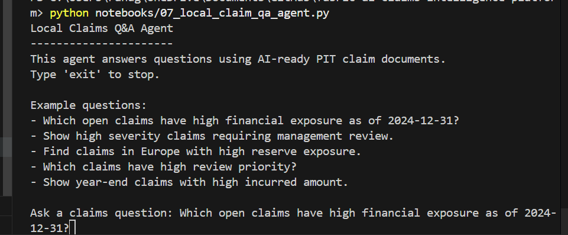
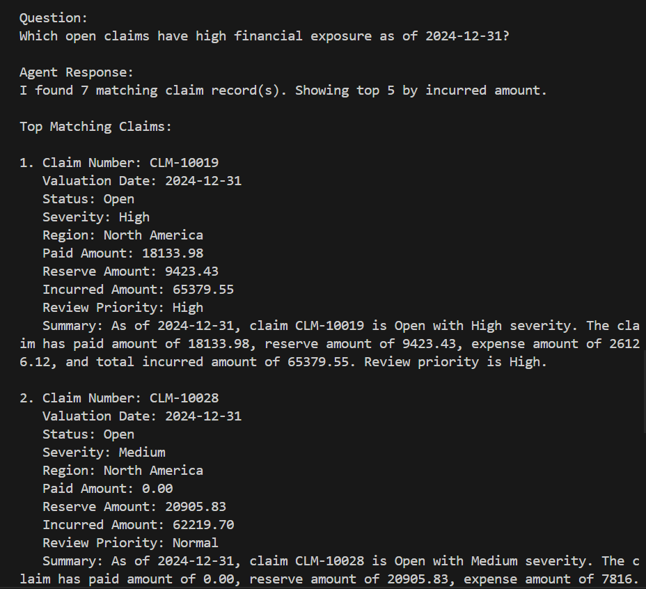
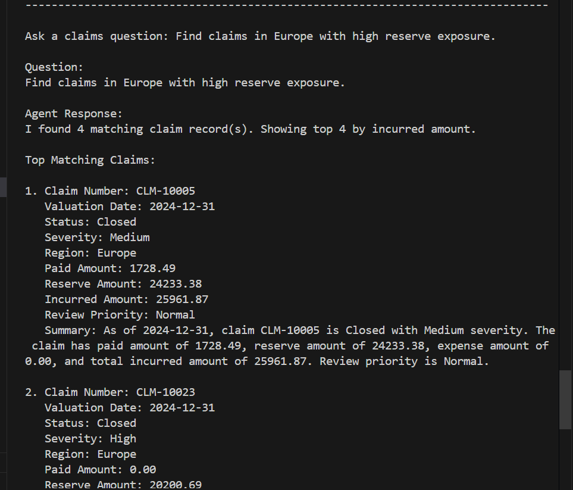

# Local Claims Q&A Agent Demo

## Overview

This demo shows a lightweight local Q&A agent running on top of AI-ready Point-in-Time claim documents.

The agent reads curated claim documents from:

```text
data/ai_outputs/claim_ai_documents.json
```

It then answers business-style questions using simple intent detection, filters, and ranking logic over trusted Gold/PIT data.

## Why This Matters

The project does not send raw transactional data directly to an AI layer.

Instead, the flow is:

```text
Gold/PIT Claim Snapshot
        ↓
AI-ready Claim Documents
        ↓
Local Q&A Agent
        ↓
Business-friendly Answer
```

This demonstrates how AI-style experiences can be built on top of curated data products rather than raw operational data.

## Agent Start Screen

The local agent starts from the command line and provides example questions that a claims user can ask.



## Example 1: Open Claims with High Financial Exposure

Example question:

```text
Which open claims have high financial exposure as of 2024-12-31?
```

The agent filters the AI-ready PIT documents for open claims, year-end valuation date, and high financial exposure based on incurred amount.



## Example 2: Europe Claims with High Reserve Exposure

Example question:

```text
Find claims in Europe with high reserve exposure.
```

The agent filters claim documents by region and reserve exposure, then returns the top matching claims ranked by incurred amount.



## What the Local Agent Demonstrates

The local agent demonstrates the following pattern:

```text
User Question
    ↓
Intent / Keyword Detection
    ↓
Filters over AI-ready PIT Claim Documents
    ↓
Ranking by Incurred Amount
    ↓
Business-friendly Response with Claim Summary
```

## Supported Question Patterns

The current local agent supports basic question patterns such as:

- Open claims
- Closed claims
- Reopened claims
- High severity claims
- High review priority claims
- Claims by region
- Year-end claims
- High incurred amount
- High reserve exposure
- Financial exposure queries

## Current Limitation

This is a local rule-based Q&A agent. It does not use an LLM yet.

The next possible enhancement is to connect the same AI-ready claim documents to:

- Azure AI Search
- Azure OpenAI
- Microsoft Fabric Data Agent
- A RAG-style retrieval and response pipeline

## Portfolio Value

This demo shows how an Azure/Fabric Data Engineer can prepare trusted insurance claims data for AI-assisted analytics by creating curated PIT outputs, AI-ready documents, and an agent-style query interface.
